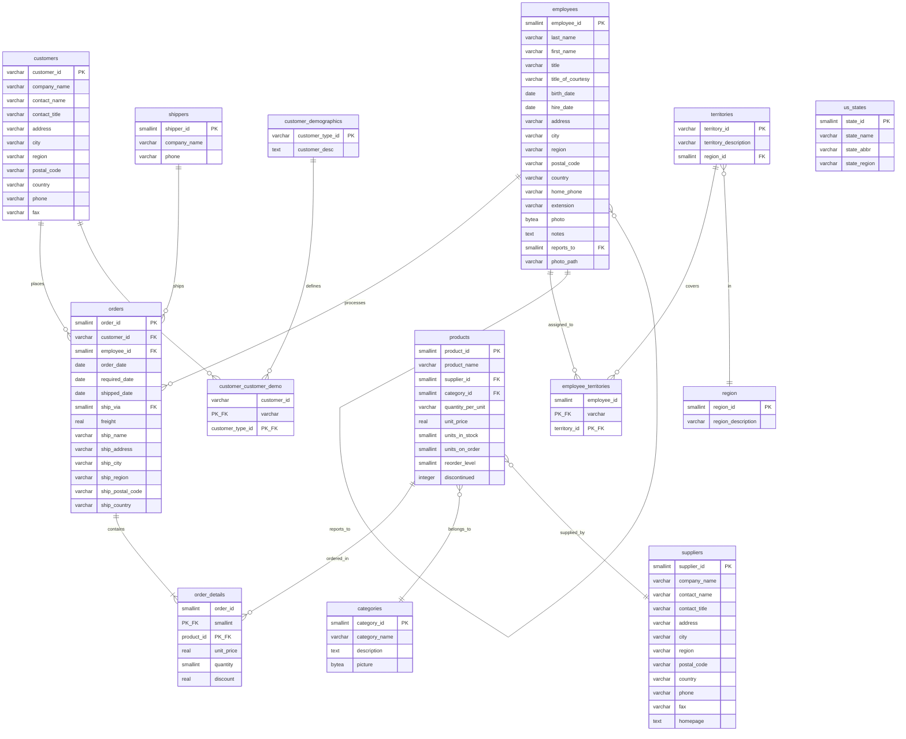

# Northwind Database ERD

## Key Relationships

### Core Business Flow
1. **Customers** place **Orders**
2. **Employees** process **Orders**
3. **Orders** contain **Order Details** (line items)
4. **Order Details** reference **Products**
5. **Shippers** ship **Orders**

### Product Management
- **Products** belong to **Categories**
- **Products** are supplied by **Suppliers**

### Employee Management
- **Employees** can report to other **Employees** (hierarchical)
- **Employees** are assigned to **Territories**
- **Territories** belong to **Regions**

### Customer Segmentation
- **Customers** can have demographic classifications via **Customer Demographics**

## Database Statistics
- **14 tables** total
- **13 foreign key relationships**
- **3 many-to-many relationships** (employee_territories, customer_customer_demo, order_details)
